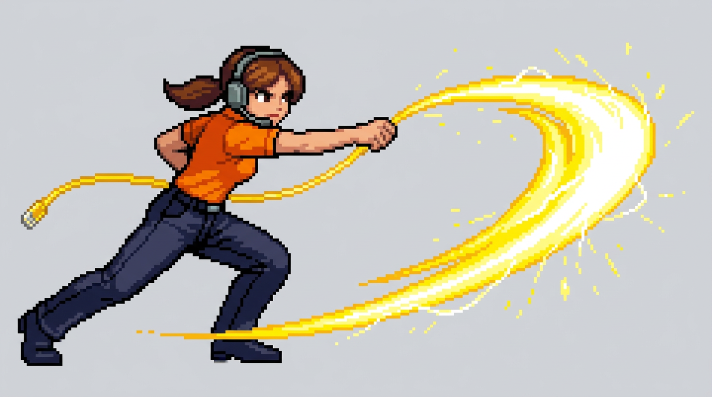
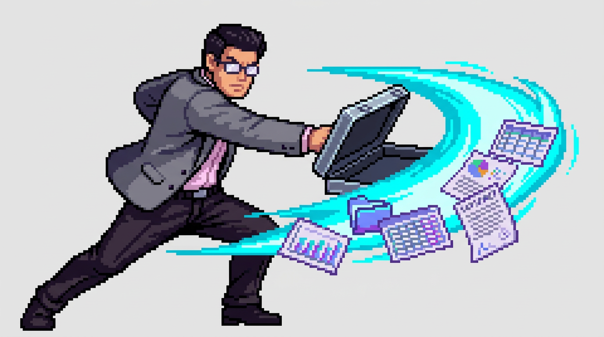
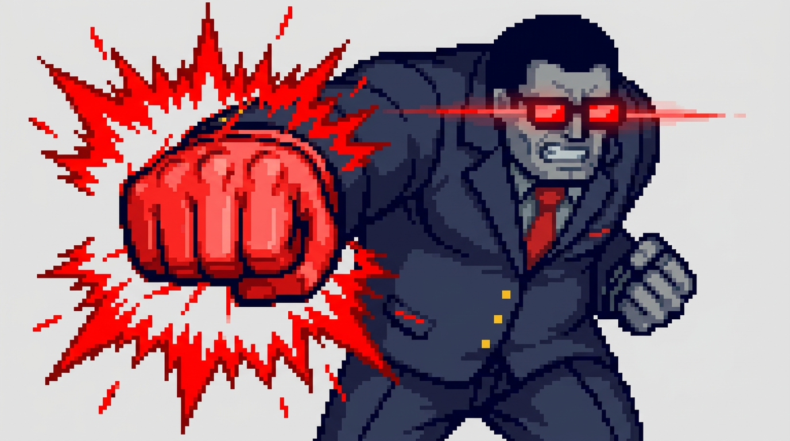

# 🎮 Attack Animation Design Proposals: Support, PS & Final Boss

> [!NOTE]
> **Pre-Implementation Design Review**: No code has been altered yet. Review the proposed attack frames, combat poses, and motion effects below before we process the transparent game sprites and wire them into the engine.

---

## 🎧 1. Support Associate: "Ethernet Cable Whip" Strike
* **Role**: Playable Support Specialist (Triage / Fast Combat)
* **Base Sprite**: `player_support.png` (Orange polo, headset, coiled yellow cable)

### Animation Breakdown & Visual Details:
* **Stance**: Deep martial arts forward lunge with front knee bent and rear leg firmly rooted.
* **Attack Motion**: Uncoils her heavy-duty bright yellow Cat-6 ethernet cable and violently cracks it forward like an electric bullwhip or high-voltage lasso.
* **FX & Particle Trails**: A wide sweeping crescent arc of high-voltage yellow electrical discharge with sparks and pixel whoosh lines.
* **Engine Integration**:
  * Asset: `public/assets/sprites/player_support_attack.png`
  * Hooked into `drawPlayer()` when `player.role === 'support'` and `player.state === 'attack'`.
  * Matches the horizontal reach and hitbox of the Tech Associate's keyboard sword.

---

## 💼 2. PS Associate: "Deliverables SOW" Briefcase Slash
* **Role**: Playable Professional Services Consultant (High Damage / Tactical)
* **Base Sprite**: `player_ps.png` (Grey tailored blazer, pink dress shirt, glasses, cyan project folder)

### Animation Breakdown & Visual Details:
* **Stance**: Aggressive forward lunging consultant strike, balancing low on back leg.
* **Attack Motion**: Thrusts open a sleek brushed-titanium executive briefcase in a devastating horizontal backhand slash.
* **FX & Particle Trails**: A razor-sharp glowing cyan/teal energy blade arc ejecting glowing quarterly reports, Gantt charts, contracts, and deliverable folders directly into the enemy line.
* **Engine Integration**:
  * Asset: `public/assets/sprites/player_ps_attack.png`
  * Hooked into `drawPlayer()` when `player.role === 'ps'` and `player.state === 'attack'`.
  * Triggers crisp slashing sound cues and deliverable chart impact particles.

---

## 👔 3. The Manager (Final Boss): "Micromanaged!" Haymaker Punch
* **Role**: Final Boss (The Manager)
* **Existing Sprites**: `manager_stand.png` (idle/walk) and `manager_slam.png` (ground slam)

### Animation Breakdown & Visual Details:
* **Stance**: Hulking forward charge with immense corporate presence.
* **Attack Motion**: Used for the **"MICROMANAGED!"** direct attack (`attackDamage * 1.3`). Replaces the current behavior where every attack showed the ground slam pose. Drives a massive, heavyweight right haymaker fist straight forward.
* **FX & Particle Trails**:
  * Blinding red impact shockwave starburst radiating from the clenched fist.
  * Fiery red laser trails streaking horizontally from his glowing rectangular sunglasses.
* **Engine Integration**:
  * Asset: `public/assets/sprites/manager_punch.png`
  * Code logic in `src/graphics/sprites.js`:
    * When `isSlamming` (Attack 2): Renders `manager_slam.png` with ground shockwaves.
    * When `isPunching / Micromanaging` (Attack 1): Renders `manager_punch.png` with the red fist shockwave.
    * Otherwise: Renders `manager_stand.png`.

---

## 📊 Summary of Proposed Animation States

| Character | Idle / Walk Frame | Proposed Attack Frame | Weapon / Action |
| :--- | :--- | :--- | :--- |
| **Support Associate** | `player_support.png` | `player_support_attack.png` | **Ethernet Cable Whip** (Yellow electric arc) |
| **PS Associate** | `player_ps.png` | `player_ps_attack.png` | **Deliverables Briefcase Slash** (Cyan chart arc) |
| **The Manager (Final Boss)** | `manager_stand.png` | `manager_punch.png` | **Micromanaged Haymaker Punch** (Red starburst shockwave) |
