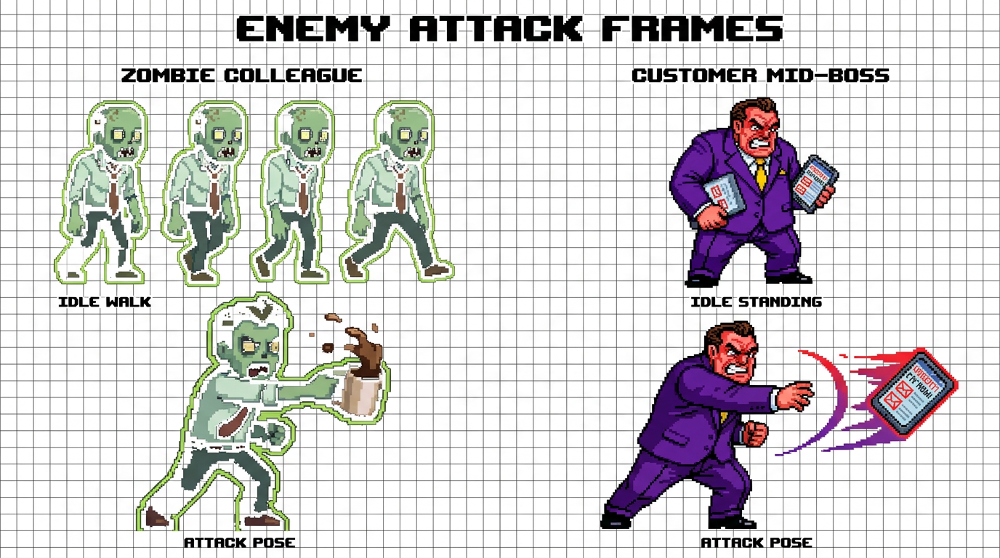
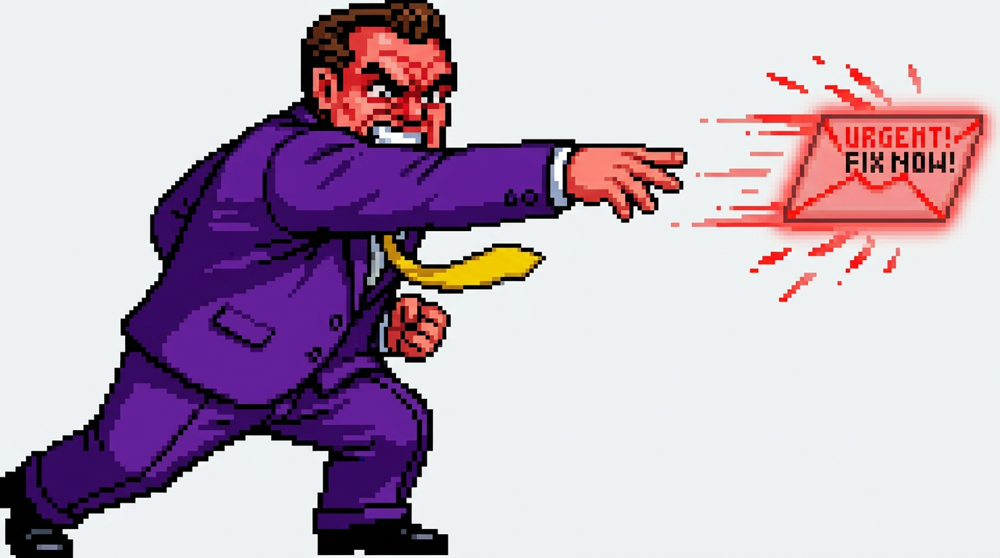
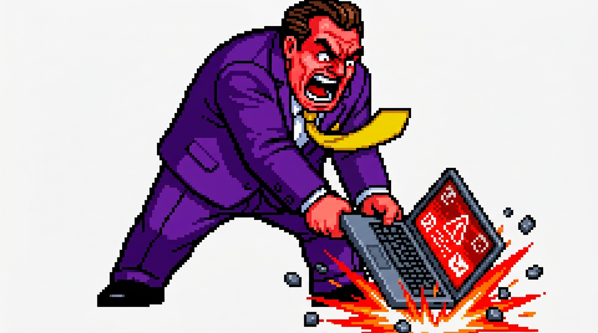

# 🎯 Customer Mid-Boss Attack Frame Design Proposal

> [!NOTE]
> **Pre-Implementation Review**: No code has been altered yet. This document presents the attack frame concepts and animation logic for your review and approval.

---

## 🔍 Comparative Analysis: Zombie Colleague vs. Customer Mid-Boss

In the current game code, the **Zombie Colleague** transitions from a passive upright shuffle into an aggressive, dynamic forward lunge:

```
[Zombie Walk]               ──> [Zombie Attack]
Upright, arms dangling          Deep forward lunge, front knee bent, rear leg driven back,
Slack jaw, passive shuffle      Arm violently thrusting forward, coffee mug splashing
```

However, the **Customer Mid-Boss** currently only has a single static sprite (`customer_midboss.png`). When he attacks (firing red `'urgent'` contract envelopes or striking in melee), the game engine simply bobs the standing sprite up and down with an alert `!` bubble.

By creating a dedicated **Attack Frame** for the Mid-Boss, we give him the exact same kinetic impact, weight, and retro beat-'em-up action responsiveness as the zombie and boss!

---

## 🎨 Frame Comparison Sheet



### Key Pose Adaptations:
1. **Combat Stance (Weight Distribution)**:
   - Rear leg stretches straight back to anchor the lunge.
   - Front leg bends deep at the knee, lowering his center of gravity.
   - Torso leans forward aggressively into the player's direction.
2. **Action & Weapon Delivery**:
   - The right arm violently thrusts forward toward the player.
   - Releases the glowing red `URGENT! FIX NOW!` contract envelope / tablet with trailing crimson action lines.
3. **Facial Expression & Secondary Motion**:
   - Furious shouting mouth, gritted teeth, red flushed forehead with furrowed brow.
   - Yellow tie whips backward in the slipstream of his forward thrust.

---

## 🖼️ Attack Frame Variations

### Option A: The "Urgent Requirement" Projectile Pitch *(Recommended)*
*Designed specifically for his ranged envelope attack (`speed: 9`).*



* **Pose**: Overhand pitcher / quarterback thrust.
* **Effect**: Hurls a glowing red envelope that streaks forward with pixel spark trails.
* **Left Hand**: Clenched in a tight, furious fist.

---

### Option B: The "Laptop Rage Smash" (Two-Handed Downward Slam)
*Designed for furious close-quarters melee combat.*



* **Direct Laptop Grip**: The Mid-Boss grips the open enterprise laptop directly with **both hands** around the chassis and keyboard base (no handle).
* **Violent Downward Smash**: Raises the laptop overhead and drives it straight down into the floor in a powerful wide-stance slam.
* **Impact FX**: The open screen flashes with a red warning alert as bright red & orange impact sparks and shattered keyboard keys erupt upon slamming into the ground.
* **Secondary Motion**: Shouting in fury with bared teeth, and yellow necktie whipped upward from the downward velocity.

---

## ⚙️ How It Plugs into the Existing Engine

Once approved, implementing this will be completely seamless:

1. **New Asset**:
   - `public/assets/sprites/customer_midboss_attack.png`
   - Resolution matches the mid-boss proportions (`160×150` px bounding box with foot anchor at `(0, 0)`).
2. **Preloading** (`src/graphics/sprites.js`):
   ```javascript
   this.images.customer_midboss_attack = await this.loadImage('/assets/sprites/customer_midboss_attack.png');
   ```
3. **Render Logic** (`src/graphics/sprites.js`):
   ```javascript
   } else if (type === 'boss' || type === 'midboss') {
     const isAttacking = e.state === 'attack' || (e.attackCooldown > 35 && e.attackCooldown <= 75);
     const img = isAttacking && this.images.customer_midboss_attack 
       ? this.images.customer_midboss_attack 
       : this.images.customer_midboss;
   ```
4. **Zero Mechanics Breakage**:
   - Projectile trajectories, hitboxes, audio cues (`sound.playSwing`), and health meters remain identical.
